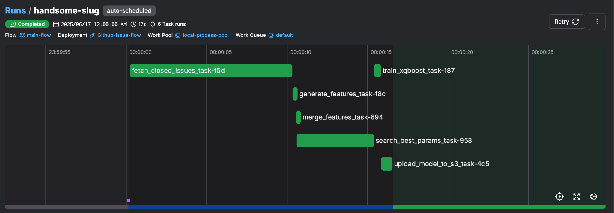
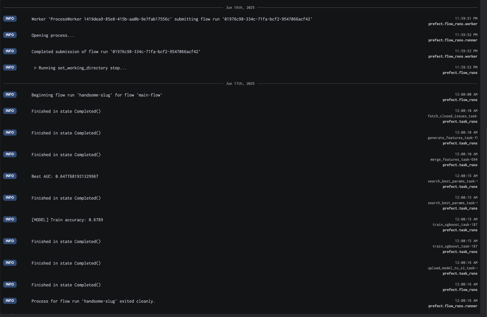

# Issue-Copilot — Training & Model Lifecycle

 
 
Predict whether a **huggingface/transformers** issue will close in **7 days**,  
with an automated pipeline that **fetches - features - tunes - trains - pushes to S3**.

> **Serving repo:**  [`mlops-serve`](https://github.com/Arsney091289421/mlops-serve)

## Features

| Category | What you get |
|----------|--------------|
| **Data ingest** | Full & incremental GitHub API crawler |
| **Feature engineering** | 10+ issue meta features (length, labels, comments) |
| **Auto-tuning & train** | Optuna - XGBoost (30 trials) • **AUC ≈ 0.65** |
| **Versioning & export** | `latest_model.json` + `history/` - **S3** |
| **Orchestration** | Prefect DAG, alert when **AUC < 0.60** |
| **CI** | `pytest + moto` mocks • GitHub Actions |

### Workflow & Automation



<details><summary>Flow run log &amp; AUC</summary>



</details>

## Tech Stack
`Python 3.9` • **Prefect 2** • **XGBoost** • AWS S3 • `pytest + moto` • **GitHub Actions**

## System Architecture


## Table of Contents

<details>
<summary>Click to expand</summary>

<br>

1. [Project Overview](#1-project-overview)  
2. [Features](#2-features)  
3. [Tech Stack](#3-tech-stack)  
4. [System Architecture](#4-system-architecture)  
5. [Quick Start](#5-quick-start)  
   - [Prerequisites](#51-prerequisites)  
   - [Deployment](#52-deployment)  
6. [Workflow & Automation](#6-workflow--automation)  
   - [Full Workflow Overview](#61-full-workflow-overview)  
   - [Prefect Scheduling & Monitoring](#62-prefect-scheduling--monitoring)  
   - [Why Prefect?](#63-why-prefect)  
7. [Configuration](#7-configuration)  
   - [Environment Variables](#71-environment-variables)  
   - [config.json](#72-configjson)  
8. [Integration with mlops-serve](#8-integration-with-mlops-serve)  
   - [Model Sync via S3](#model-sync-via-s3)  
   - [Data/Prediction Exchange](#dataprediction-exchange)  
9. [Testing](#9-testing)  
   - [How to run tests](#91-how-to-run-tests)  
   - [Test Coverage & Mock Strategy](#test-coverage--mock-strategy)  
10. [FAQ](#10-faq)  
11. [Maintainers & Contact](#11-maintainers--contact)

</details>

## 5. Quick Start

### 5.1 Prerequisites

- **AWS Account**
  - An S3 bucket for storing trained models (`models/latest_model.json`)
- **GitHub Personal Access Token**
  - Only `public_repo` scope is required for collecting public issue data
- **Python 3.9 environment**
  - Can be a local machine or cloud VM (e.g., AWS EC2)
- **(Optional) Prefect UI**
  - For workflow visualization, monitoring, and alerting

> **Note:**  
> To avoid Prefect Cloud subscription fees, use `prefect server start` to run a local Prefect server for free workflow scheduling and monitoring.

---

### 5.2 Deployment

1. **Clone the repository**

   ```bash
   git clone https://github.com/Arsney091289421/MLOps-Sandbox-for-github-issues.git
   cd MLOps-Sandbox-for-github-issues
   ```

2. **Install dependencies**

   ```bash
   pip install -r requirements.txt
   pip install -e .
   # enables import via package name without modifying paths
   ```

3. **Configure environment variables**

   ```bash
   cp .env.example .env
   # Edit .env to match your S3 bucket, GitHub token, and local directory settings
   ```

4. **Run full data fetch and feature generation**

   ```bash
   chmod +x run_full_init.sh
   bash run_full_init.sh
   # This will download all closed issues and generate the full feature dataset.
   ```

5. **Run the main workflow**

   ```bash
   python main_flow.py
   # This will execute the entire Prefect workflow: incremental data fetch, feature engineering, feature merging, hyperparameter tuning, model training, and model export to S3.
   ```

## 6. Workflow & Automation

### 6.1 Full Workflow Overview

Orchestrated via `main_flow.py` using Prefect. Each step is a modular task:

1. Fetch closed GitHub issues  
2. Extract & merge features  
3. Run Optuna for best XGBoost params  
4. Train final model  
5. Upload model to S3  
6. Monitor runs & AUC via Prefect UI

### 6.2 Prefect Scheduling & Monitoring

#### Local Prefect Setup

Use Prefect’s local server for free scheduling, monitoring, and alerting.

1. **Start local server** (once):

   ```bash
   prefect server start
   # UI at http://127.0.0.1:4200
   ```

2. **Create a work pool**:

   ```bash
   prefect work-pool create my-local-pool --type process
   ```

3. **Start a local agent**:

   ```bash
   prefect agent start -p my-local-pool
   ```

4. **Run your flow**:
   Running your `@flow` function (e.g. in `main_flow.py`) will auto-register it.
   You can then trigger it or schedule it via the UI.

   *Use the UI “Deployments” tab to set up schedules (e.g. daily at 5 AM).*


> **Note:** **Ensure your machine doesn’t sleep.** Recommended: desktop or cloud server.
> macOS: use Amphetamine / `pmset`; Windows: set power options to “never sleep”.

#### AUC Threshold Alerting

In hyperparameter search, an alert triggers if AUC drops below a threshold:

```python
auc_alert_threshold = 0.6

if auc < auc_alert_threshold:
    logger.error(f"[ALERT] Best AUC dropped below threshold! Current: {auc}")
    raise ValueError(f"Best AUC dropped below {auc_alert_threshold}: {auc}")
else:
    logger.info(f"Best AUC: {auc}")
```

Any failure shows as a red run in the UI, with full logs.

### 6.3 Why Prefect?

This project uses Prefect to manage a multi-step ML training pipeline with task dependencies, monitoring, and alerting (e.g. low AUC).

The downstream [mlops-serve](https://github.com/Arsney091289421/mlops-serve) repo focuses on model serving, using cron to run daily batch predictions — no orchestration required.


## 7. Configuration

### 7.1 Environment Variables

Set all variables in `.env` (see `.env.example`).

| Variable               | Required | Default     | Description                                 |
|------------------------|----------|-------------|---------------------------------------------|
| `GITHUB_TOKEN`         | Yes      | —           | GitHub token (`public_repo` scope)          |
| `DATA_BASE_DIR`        | Yes      | `./data`    | Base dir for data, features, and params     |
| `MODEL_DIR`            | Yes      | `./models`  | Where to save trained models                |
| `AWS_ACCESS_KEY_ID`    | Yes\*    | —           | AWS key for S3 (or use EC2 IAM role)        |
| `AWS_SECRET_ACCESS_KEY`| Yes\*    | —           | AWS secret for S3                           |
| `AWS_DEFAULT_REGION`   | Yes\*    | —           | AWS region                                  |
| `MODEL_BUCKET`         | Yes      | —           | S3 bucket for model upload                  |
> \*AWS credentials not required if using EC2 with IAM role.

**Notes:**
- `features/` and `params/` are stored under `${DATA_BASE_DIR}/`
- Default folders will be auto-created if missing

---

### 7.2 `config.json` 

```json
{
  "n_trials": 30
}
````

* `n_trials`: Number of Optuna tuning trials
  (higher = better tuning, more compute)
  
## 8. Integration with mlops-serve

### Model Sync via S3

After training, `latest_model.json` (saved to `model/`）and a versioned snapshot (saved to `model/history/`) are uploaded to S3.  
The [mlops-serve](https://github.com/Arsney091289421/mlops-serve) repo fetches the latest model from S3 to serve predictions.

### Data/Prediction Exchange

Inference results from [mlops-serve](https://github.com/Arsney091289421/mlops-serve) are also pushed to S3, enabling decoupled cloud-based communication between training and serving pipelines.

## 9. Testing
### 9.1 How to run tests

 ```bash
pytest tests/
```
#### Test Coverage & Mock Strategy

- Smoke test ensures key modules load correctly (`data_utils`, `model_utils`, `s3_utils`)
- Unit tests cover data processing, model training, and S3 logic with small mock datasets
- All tests use `pytest` fixtures and `tmp_path` for isolated temp files
- S3 interactions are fully mocked using [moto](https://github.com/spulec/moto); no real AWS needed

## 10. FAQ

**S3 returns 403 / Access Denied?**  
→ Check AWS credentials and S3 permissions. On EC2, prefer IAM role (no `.env` secrets needed).

**GitHub token fails to fetch issues?**  
→ Ensure `GITHUB_TOKEN` has `public_repo` scope and is valid.

**No flow or scheduling error in Prefect UI?**  
→ Create a local work pool and start an agent. Prefect Cloud free tier does **not** support work pools — use `prefect server start` locally.

## 11. Maintainers & Contact

- Maintainer: [Arsney091289421](https://github.com/Arsney091289421)
- Email: leearseny3@gmail.com
- Feedback and issues are welcome—please use [GitHub Issues](https://github.com/Arsney091289421/mlops-serve/issues)
